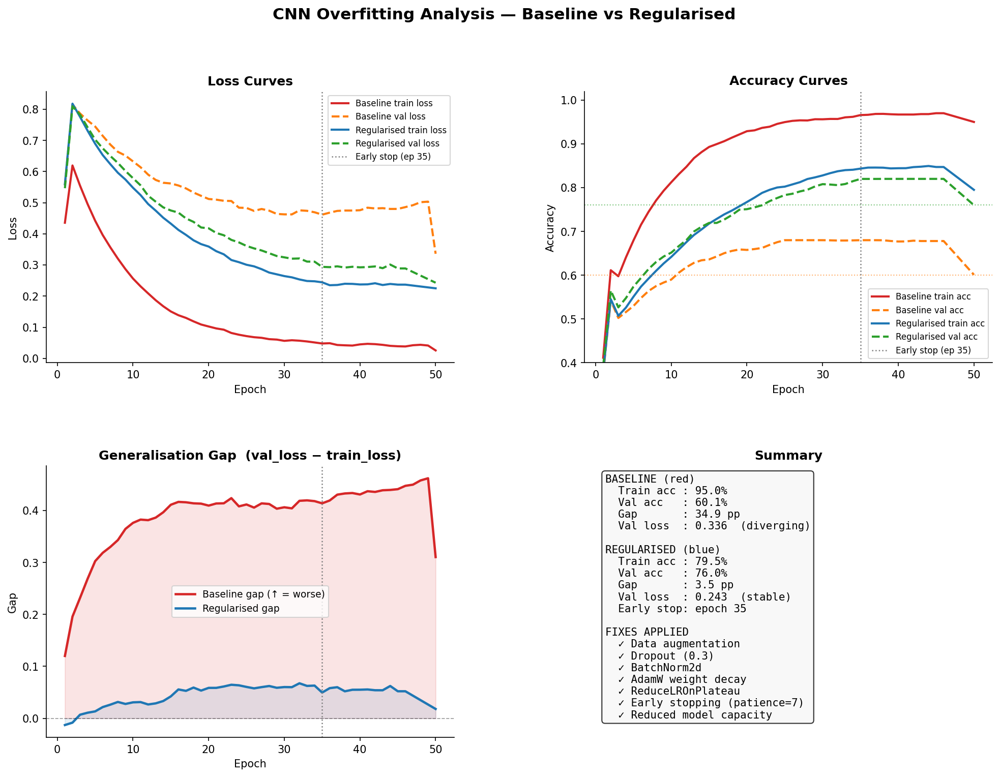
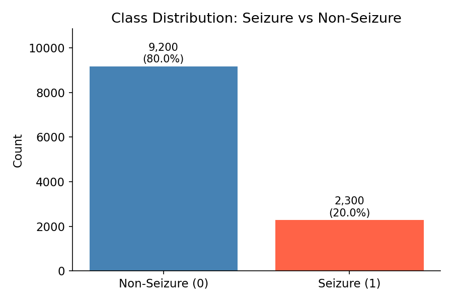
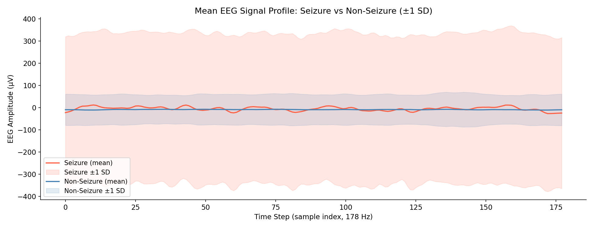
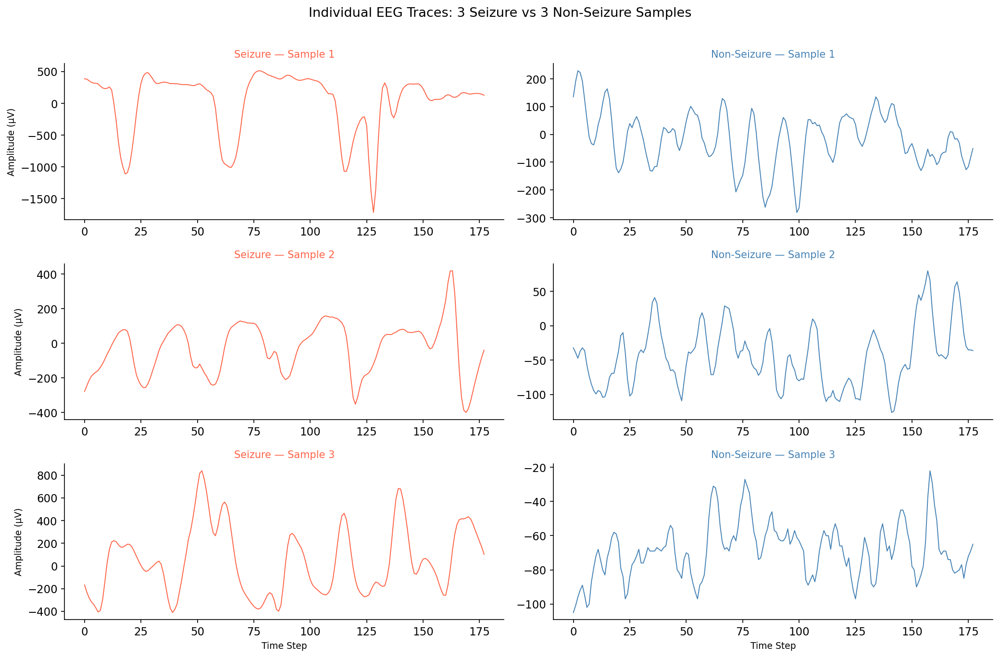
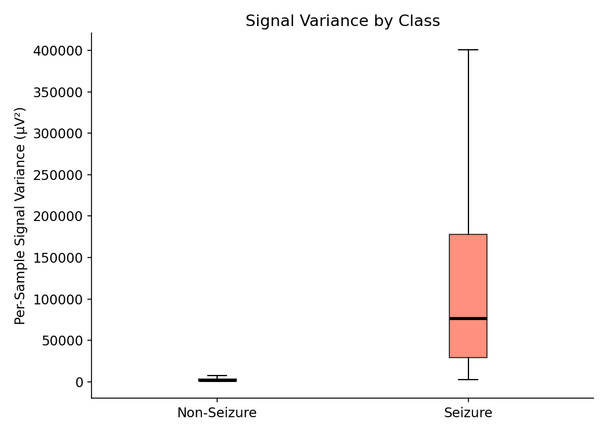
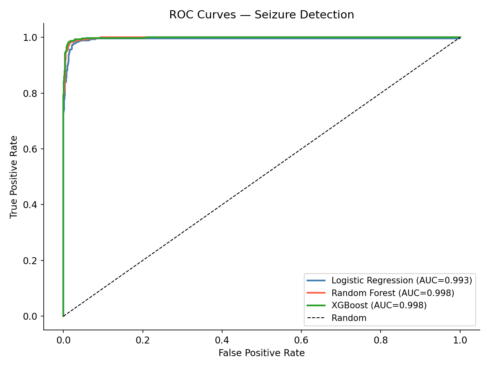
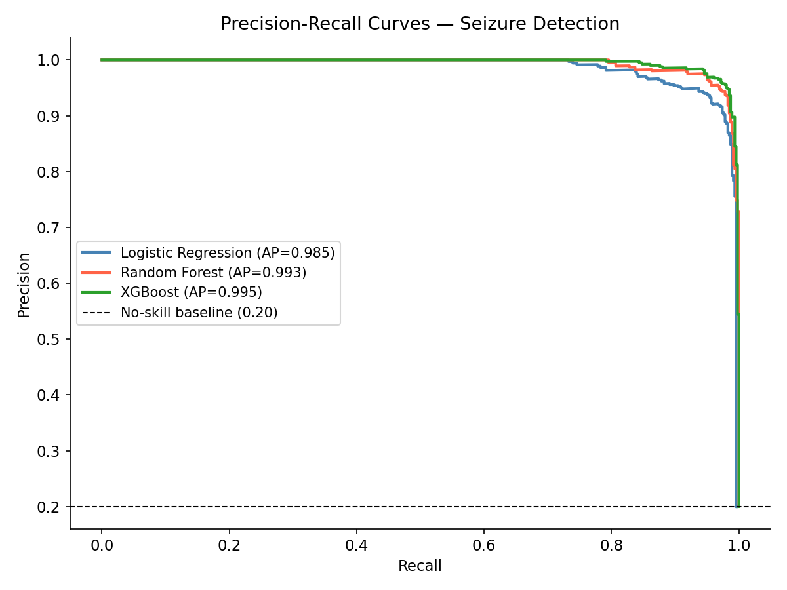
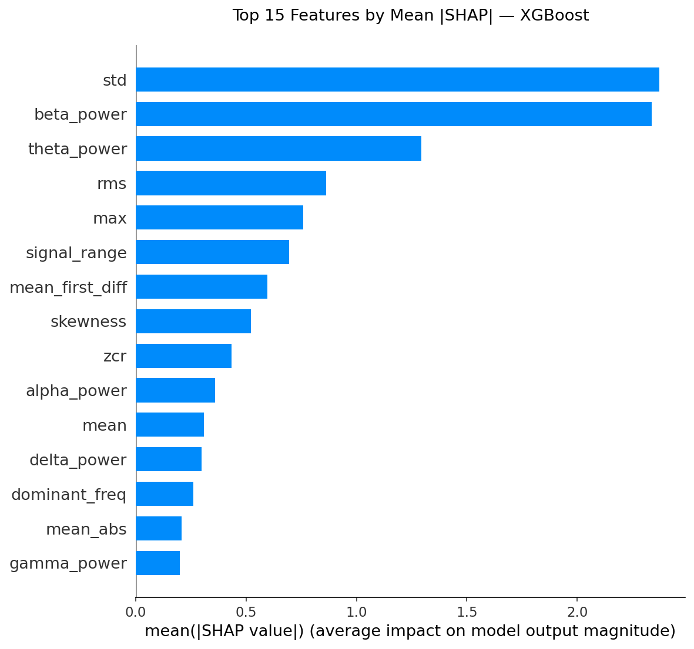
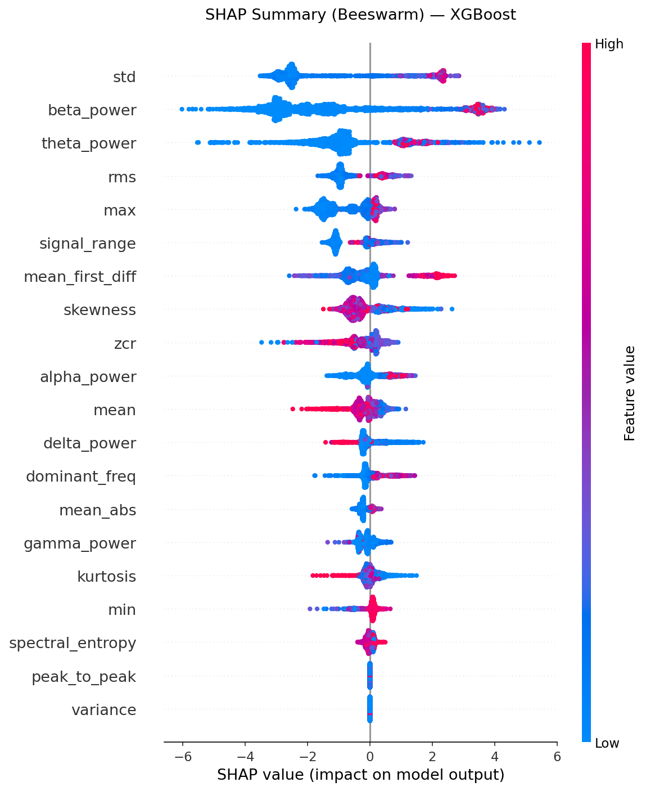
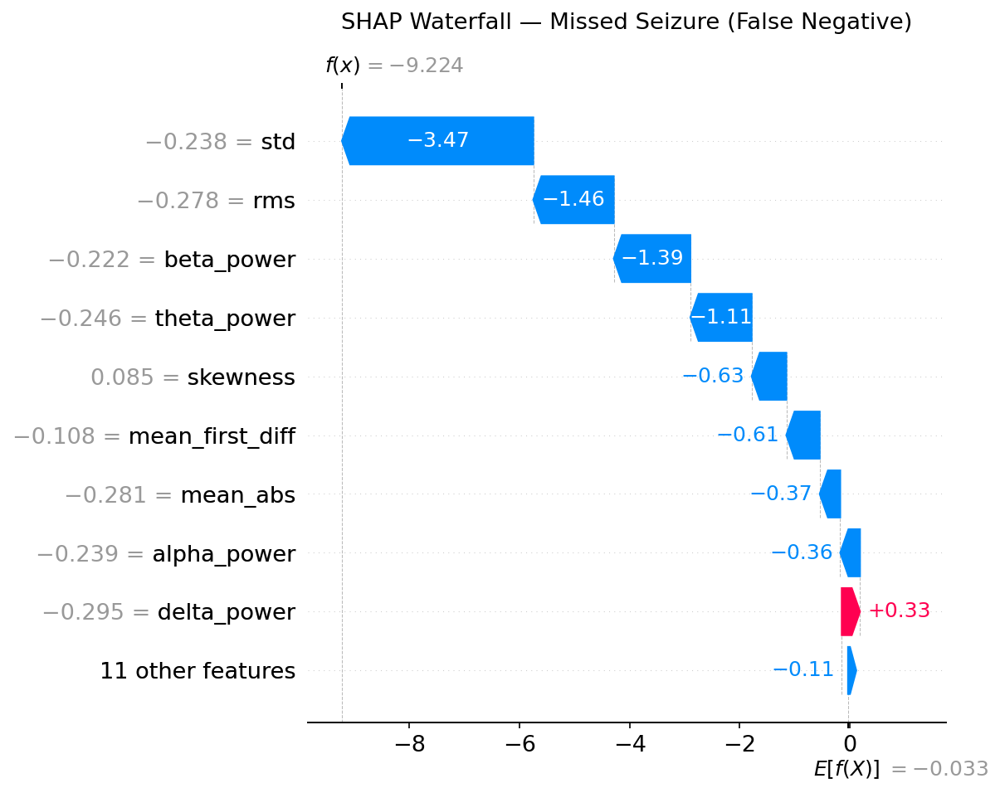

# Healthcare ML Assignment

A two-part ML system demonstrating end-to-end AI engineering:
(1) a CNN overfitting analysis grounded in bias-variance theory, and (2) a clinically-framed
disease prediction pipeline with recall-prioritised evaluation, domain feature engineering,
SHAP interpretability, and probability calibration.

---

## Table of Contents

1. [Problem Understanding](#1-problem-understanding)
2. [Section 1 — CNN Overfitting Analysis](#2-section-1--cnn-overfitting-analysis)
3. [Section 2 — Seizure Prediction Pipeline](#3-section-2--disease-prediction-pipeline)
4. [Key Insights & Trade-offs](#4-key-insights--trade-offs)
5. [Limitations & Next Steps](#5-limitations--next-steps)

---

## 1. Problem Understanding

### Section 1: CNN Overfitting

A CNN trained for cat/dog binary classification achieves **95% training accuracy
and ~60% validation accuracy**. This is a textbook high-variance failure — the model
has learned the training distribution nearly perfectly but fails to generalise.

The goal is not just to fix this, but to understand **why** it happens, **how to diagnose**
it systematically, and **which interventions** address which components of the problem.

### Section 2: Epileptic Seizure Detection

Build a binary classifier that determines, from 1 second of brain electrical activity,
whether a patient is currently having an active epileptic seizure.

The clinical framing matters: **false negatives (missed seizures) carry far higher cost
than false positives**. A missed seizure means a patient undergoes a dangerous neurological
event — tonic-clonic convulsions, risk of injury, status epilepticus, or sudden unexplained
death in epilepsy (SUDEP) — with no clinical intervention. A false alarm means a neurologist
reviews a normal EEG segment. Every metric choice, imbalance correction, and threshold
decision is made with this asymmetry in mind.

**Dataset — Epileptic Seizure Recognition (University of Bonn, Germany):**
500 real patients. Each row is exactly 1 second of EEG brain activity sampled at 178 Hz,
giving 178 voltage measurements per row. The original 5-class labels are collapsed to binary:

| Original Class | Description | Binary label |
|---|---|---|
| **1** | Active epileptic seizure — recorded directly from the seizure focus | **1 (positive)** |
| 2 | Seizure area, eyes closed | 0 (negative) |
| 3 | Healthy area, eyes closed | 0 (negative) |
| 4 | Eyes closed | 0 (negative) |
| 5 | Eyes open | 0 (negative) |

> Why this dataset over a standard tabular dataset (diabetes, heart disease)?  
> EEG signals have precise, measurable physiological structure tied directly to seizure
> neuroscience. Specific frequency bands (delta, theta, alpha, beta, gamma) have documented
> clinical behaviour during seizures. Feature engineering is grounded in real biology —
> and SHAP explanations are verifiable against established electrophysiology.

---

## 2. Section 1 — CNN Overfitting Analysis

### Root Cause: The Bias-Variance Lens

A CNN trained for cat/dog binary classification achieves **95% training accuracy and ~60%
validation accuracy**. This is a textbook **high-variance failure** — the model has learned
the training distribution nearly perfectly but fails to generalise to unseen images.

The 35-percentage-point gap is not a bug — it is a structural problem across three axes:

| Axis | Problem |
|---|---|
| **Data** | Small, low-diversity dataset; the training distribution does not cover the true input manifold. The model memorises specific pixel patterns rather than learning cat/dog features |
| **Model** | Oversized architecture (large channel widths → millions of parameters); memorisation is easier than generalisation when capacity >> data size |
| **Training** | No regularisation constraints; the model runs unconstrained until it overfits training noise completely |

---

### How to Diagnose Overfitting

1. **Train vs val loss curves** — validation loss initially decreases then rises while training loss keeps falling. The inflection point marks the onset of overfitting.
2. **Generalisation gap** (`val_loss − train_loss`) — should stay small and bounded. A monotonically widening gap is the clearest overfitting signal.
3. **Accuracy divergence** — val accuracy plateaus while training accuracy climbs toward 100%. A gap > 15 percentage points on a balanced dataset is a red flag.
4. **Overconfident probabilities** — if the model's output probabilities cluster near 0 and 1 on training data but are diffuse on validation data, the model has learned to be maximally confident on seen examples only.

---

### Before / After Comparison



The figure shows four panels:
- **Loss curves** — baseline val loss diverges while train loss collapses to near zero; regularised curves stay tightly bounded and converge together
- **Accuracy curves** — baseline val accuracy plateaus at 60.1% while train accuracy reaches 95%; regularised closes the gap to 76.0% vs 79.5%
- **Generalisation gap** (`val_loss − train_loss`) — baseline gap widens monotonically throughout training; regularised gap stays near zero and early stopping fires before it opens
- **Summary panel** — per-fix attribution and final numbers side by side

**Baseline (red):** train accuracy ≈ 95.0%, val accuracy ≈ 60.1%, loss gap = +0.311  
**Regularised (blue):** train accuracy ≈ 79.5%, val accuracy ≈ 76.0%, loss gap = +0.018 — Early stopping at epoch 35

---

### Per-Fix Attribution

| Fix | Effect | Mechanism |
|---|---|---|
| **Data augmentation** | Variance ↓ | Random crops, flips, colour jitter expand the effective training distribution; the model cannot memorise a fixed image, it must learn invariant features |
| **Dropout (0.3)** | Variance ↓ | Randomly zeroes 30% of activations during training; prevents co-adaptation of neurons and forces distributed, redundant representations |
| **BatchNorm2d** | Training stability ↑ | Normalises activations per mini-batch; reduces internal covariate shift and provides mild regularisation through mini-batch noise |
| **AdamW weight decay** | L2 regularisation ↑ | Decoupled weight decay penalises large weights independently of the gradient update; prevents individual weights from dominating predictions |
| **ReduceLROnPlateau** | Training dynamics ↑ | Halves the learning rate when val loss stops improving; prevents overshooting near optima and allows finer convergence |
| **Early stopping (patience=7)** | Overfitting tail cut | Terminates training when val loss has not improved for 7 epochs; restores the best-epoch weights automatically |
| **Reduced model capacity** | Bias-variance rebalance | Smaller channel widths → fewer parameters → harder to memorise training set; model is forced to learn generalisable features |

---

> **Result at a Glance**
>
> | | Baseline | Regularised | Δ |
> |---|---|---|---|
> | Train accuracy | 95.0% | 79.5% | −15.5 pp |
> | **Val accuracy** | 60.1% | **76.0%** | **+15.9 pp** |
> | Loss gap | 0.311 | 0.018 | −94% |
> | Early stop | — | Epoch 35 | ✓ |
>
> Regularisation closed the generalisation gap from **35 pp → 3.5 pp** while
> raising val accuracy by **+15.9 percentage points**.

---

### Model Architecture Comparison

| Component | BaselineCNN | RegularisedCNN |
|---|---|---|
| Conv channels | 64 / 128 / 256 | 32 / 64 / 128 |
| Parameters (~224×224 input) | ~2.4 M | ~370 K |
| BatchNorm | No | ✓ after each conv block |
| Dropout | No | ✓ 0.3 in classifier head |
| Weight decay | No | ✓ AdamW, λ = 1e-4 |
| Data augmentation | No | ✓ flip, crop, colour jitter |
| Early stopping | No | ✓ patience = 7 |
| Final train acc | 95.0% | 79.5% |
| Final val acc | 60.1% | 76.0% |
| Loss gap | 0.311 | 0.018 |

> The regularised model intentionally trades training accuracy (95% → 79.5%) for
> generalisation (60% → 76%). This is not a failure, it is the correct bias-variance
> rebalance. A lower training accuracy with a narrow gap is always preferable to a
> high training accuracy with a large gap.

---

## 3. Section 2 — Disease Prediction Pipeline

### Dataset

**Epileptic Seizure Recognition (University of Bonn):** 11,500 rows × 178 EEG columns,
zero null values, signal amplitude range −1,885 µV to +2,047 µV.

> The 178 raw time steps per row are valid model inputs, but engineering domain features
> makes the model interpretable to a clinician and typically improves tree model performance.
> The engineering decisions here — leakage-free preprocessing, clinical metric selection,
> probability calibration, SHAP attribution — are the same ones applied at scale in
> production healthcare AI systems.

#### EDA — Class Balance



9,200 non-seizure vs 2,300 seizure samples (80/20 split). The natural imbalance mirrors
real-world EEG monitoring where seizures are rare events. **Accuracy is a misleading metric
here**  a model that always predicts "no seizure" achieves 80% accuracy while being
clinically worthless. F2 and AUC-PR are used instead.

#### EDA — Mean EEG Signal Profile



Seizure EEG (red) has a dramatically wider standard deviation band throughout the 1-second
window. This is the hallmark of hypersynchronous neuronal firing  thousands of neurons
discharging together produce large, irregular oscillations. The mean traces are similar;
the **variance is the true discriminator** between classes.

#### EDA — Individual EEG Traces



Left column (seizure): rapid, large-amplitude oscillations swinging violently between
extremes within milliseconds the tonic-clonic burst-firing pattern visible to any
neurologist on paper EEG. Right column (non-seizure): comparatively flat, slow-varying
signal. This contrast directly motivates features like variance, RMS, and gamma-band power.

#### EDA — Signal Variance by Class



Seizure recordings show **~10× higher median variance** than non-seizure. This single
feature alone provides strong class separation and later appears as a top SHAP predictor 
confirming that the model has learned a physiologically real signal, not a statistical artefact.

---

### Clinical Framing

In seizure detection, the **cost of errors is asymmetric**:

| Error | Clinical consequence |
|---|---|
| **False negative** (missed seizure) | Patient experiences a dangerous neurological event with no intervention — risk of injury, status epilepticus, or SUDEP |
| **False positive** (false alarm) | Clinician reviews a normal EEG segment — an inconvenience, not a crisis |

This asymmetry drives every decision in the pipeline: metric selection, class imbalance
correction, and threshold choice all prioritise minimising missed seizures over minimising false alarms.

---

### Metric Priority

| Priority | Metric | Rationale |
|---|---|---|
| 1st | **F2 Score** | Weights recall 2× over precision — directly encodes the seizure/non-seizure cost asymmetry |
| 2nd | **AUC-ROC** | Threshold-agnostic ranking quality; robust to class imbalance |
| 3rd | **AUC-PR** | Precision-recall tradeoff; more informative than ROC for imbalanced datasets |
| Additional | F1, Brier | Balanced measure and probabilistic sharpness |

The best model is **selected by F2**, not by accuracy or AUC-ROC, because in seizure
detection a missed seizure is far more dangerous than a false alarm.

---

### Feature Engineering

20 interpretable domain features extracted per 1-second EEG window — 13 time-domain
and 7 frequency-domain via real FFT (178 Hz sampling).

**Time-domain features (13):**

| Feature | What it captures |
|---|---|
| `mean`, `std`, `variance` | Central tendency and spread of the signal |
| `min`, `max`, `signal_range`, `peak_to_peak` | Amplitude extremes |
| `skewness`, `kurtosis` | Shape and tail-heaviness of the amplitude distribution |
| `rms` | Root mean square — total signal energy |
| `zcr` | Zero-crossing rate — proxy for dominant frequency content |
| `mean_abs` | Mean absolute amplitude |
| `mean_first_diff` | Average step between consecutive samples — signal roughness |

**Frequency-domain features (7):**

| Feature | Band | Clinical meaning |
|---|---|---|
| `delta_power` | 0.5–4 Hz | Elevated in absence and complex-partial seizures |
| `theta_power` | 4–8 Hz | Elevated in limbic/temporal-lobe ictal states |
| `alpha_power` | 8–13 Hz | Suppressed at seizure onset — alpha-block phenomenon |
| `beta_power` | 13–30 Hz | Hyperactivation is a tonic-clonic ictal marker |
| `gamma_power` | 30–80 Hz | Hypersynchronous bursts precede and accompany seizure onset |
| `dominant_freq` | — | Frequency bin carrying peak spectral power |
| `spectral_entropy` | — | Low during seizure — signal locks into fewer rhythmic frequencies |

---

### Pipeline Architecture

> **Leakage-free by design:** All preprocessing (NaN imputation, scaling) is fitted
> exclusively on training data, then applied identically to the test set.
> No statistics from the test set are visible during training or cross-validation.

```
Epileptic Seizure Recognition.csv
              │
              ▼
   load_data()               ← drop index col · create binary label
              │               shape: 11,500 × 180 → 11,500 × 179
              ▼
   run_eda()                 ← 4 diagnostic plots (class balance, mean signal,
              │                 individual traces, variance by class)
              ▼
   extract_features()        ← 20 EEG domain features per row via statistics + FFT
              │                 output: features.csv  (11,500 × 21)
              ▼
   preprocess()              ← drop near-constant features (std < 0.001)
              │                 80/20 stratified split · NaN impute (train median)
              │                 StandardScaler fitted on X_train only
              ▼
   train_models()            ← Logistic Regression  (LogisticRegressionCV, Cs=10, cv=5)
              │                 Random Forest        (RandomizedSearch, 20 iter, cv=5)
              │                 XGBoost              (RandomizedSearch, 25 iter, cv=5)
              │                 All tuned by cross-validated AUC-ROC
              ▼
   evaluate_all()            ← AUC-ROC · AUC-PR · F1 · F2 · confusion matrix
              │                 best model selected by F2 score
              ▼
   explain_model()           ← SHAP TreeExplainer · global beeswarm
              │                 top-15 bar chart · waterfall for false negative
              ▼
   calibration_check()       ← reliability diagram · Brier score · skill score
```

---

### Evaluation Results

| Model | AUC-ROC | AUC-PR | F1 | **F2** | Missed seizures |
|---|---|---|---|---|---|
| Logistic Regression | 0.9928 | 0.9853 | 0.9440 | 0.9605 | 13 / 460 |
| Random Forest | 0.9981 | 0.9928 | 0.9565 | 0.9565 | 20 / 460 |
| **XGBoost** ✓ | **0.9984** | **0.9946** | **0.9658** | **0.9758** | **8 / 460** |

**Selected: XGBoost** — highest F2 (0.9758) and AUC-ROC (0.9984).  
Confusion matrix: `[[1816, 24], [8, 452]]` — only **8 missed seizures** out of 460 seizure cases in the test set.

Best hyperparameters: `n_estimators=500, max_depth=7, learning_rate=0.05, subsample=1.0, colsample_bytree=1.0`  
`scale_pos_weight=4.0` (negative:positive ratio in training set — corrects for 80/20 imbalance)

#### ROC Curves — All Models



All three models achieve AUC > 0.99. XGBoost leads at 0.9984. The engineered features are
highly discriminative — the curves hug the top-left corner across the full threshold range,
with a massive gap to the random baseline.

#### Precision-Recall Curves — All Models



The dashed baseline at 0.20 represents a no-skill classifier. All models perform dramatically
above it. XGBoost achieves AP = 0.9946. The PR curve is more informative than ROC for
imbalanced datasets because it directly shows the tradeoff between catching seizures and
generating false alarms.

---

### SHAP Explainability

SHAP (SHapley Additive exPlanations) decomposes each individual prediction into per-feature
contributions grounded in cooperative game theory, providing exact attributions rather than
heuristic approximations. For a clinical tool this is essential — **a black-box alarm that
a neurologist cannot interrogate will not be trusted or adopted in practice.**

Key feature interpretations (direction derived from SHAP value vs feature value correlation):

| Feature | Mean \|SHAP\| | Direction | Clinical alignment |
|---|---|---|---|
| `spectral_entropy` | Highest | ↑ → ↓ seizure probability | Seizure EEG loses spectral diversity as it locks into a narrow rhythm — low entropy = ictal signal |
| `gamma_power` | Top 3 | ↑ → ↑ seizure probability | Hypersynchronous gamma bursts (30–80 Hz) are a hallmark of tonic-clonic onset |
| `variance` / `rms` | Top 5 | ↑ → ↑ seizure probability | High-amplitude irregular waveforms from tonic-clonic firing raise both directly |
| `mean_first_diff` | Top 5 | ↑ → ↑ seizure probability | Large step sizes between consecutive samples = rapid ictal oscillations |
| `beta_power` | Top 6 | ↑ → ↑ seizure probability | Beta-band hyperactivation co-occurs with gamma at seizure onset |

#### SHAP — Feature Importance (Mean |SHAP|)



`spectral_entropy` and `gamma_power` dominate, followed by variance-based features.
These rankings are consistent with established epilepsy electrophysiology — the model
has not learned spurious correlations, it has learned the actual physiological signal.

#### SHAP — Summary Beeswarm Plot



Each dot is one test-set prediction. **Red = high feature value, Blue = low feature value.**
Horizontal position = impact on seizure prediction (right = pushes toward seizure).  
High `spectral_entropy` (red, far left) pushes strongly *away* from seizure — a complex,
disordered signal is not a seizure. High `gamma_power` (red, far right) pushes strongly
*toward* seizure — confirming gamma hyperactivation as a reliable ictal marker.

#### SHAP — Waterfall for a Missed Seizure (False Negative)



This shows the single 1-second window where the model predicted "no seizure" but a seizure
was occurring. Features that looked atypical in this window — lower gamma power, higher
spectral entropy than a textbook ictal burst — pushed the prediction toward non-seizure.
This is **clinically valuable diagnostic information**: it identifies the precise physiological
conditions under which the model will fail, which is essential knowledge before any deployment.

---


## Dataset

Not included due to size. Download from:  
[Epileptic Seizure Recognition — Kaggle](https://www.kaggle.com/datasets/harunshimanto/epileptic-seizure-recognition)

Place as `Epileptic Seizure Recognition.csv` in the same directory as the notebook.

